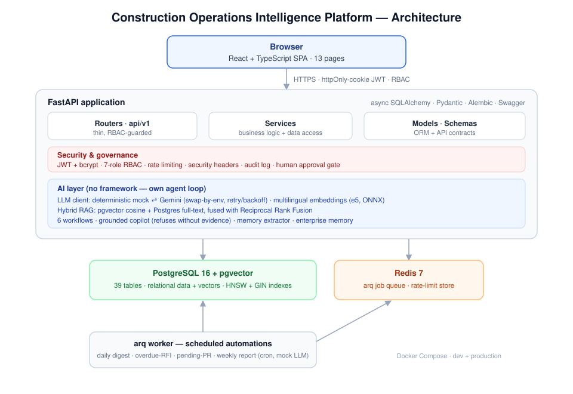

# Construction Operations Intelligence Platform

A construction company runs on documents: emails, meeting minutes, daily site reports, purchase
requests, RFIs, non-conformance reports, and claims. Most of it never gets read twice. Decisions
get made, forgotten, and re-litigated; a supplier's poor delivery history sits invisible in a
spreadsheet until a project is already late; a claim goes to arbitration and nobody can quickly
assemble the change orders, correspondence, and decisions that support it.

This platform turns that paperwork into something you can query, summarize, and act on. It ingests
real project data, keeps an organizational memory of what was decided and why, runs AI workflows
over the operational record, and answers management's questions — with every AI answer tied back to
the records it came from, and every high-risk action held behind a human approval.

It is built to be run, not just demonstrated: a FastAPI backend, a PostgreSQL/pgvector database that
loads real bilingual (English/Arabic) construction data — or realistic synthetic demo data on an
empty install — a Redis-backed job scheduler, and a React dashboard covering sixteen operational
areas that a company can populate with its own records.

## What it does

**Operational record.** Projects, procurement (purchase requests, orders, suppliers), RFIs and
change orders, claims, meetings, site reports, and a document library — all queryable with
filtering and pagination through the API and the dashboard.

**Six AI workflows**, each combining deterministic computation (where correctness matters) with an
LLM (for judgment and narrative):

- *Purchase Request Review* — flags missing information, scores risk, and factors in the assigned
  supplier's real delivery history.
- *Supplier Risk Assessment* — scores a supplier from cross-project on-time rate, NCRs, and delay
  patterns, and writes the result back as organizational memory.
- *RFI Escalation* — finds overdue RFIs and drafts an escalation with a suggested action per item.
- *Meeting Summary* — turns raw minutes into a summary, owner-assigned action items, decisions, and
  risks, and can persist them.
- *Daily Site Report Analysis* — extracts completed work, delays, risks, and an escalation
  recommendation from a field report.
- *Executive Weekly Report* — aggregates portfolio KPIs and writes an executive narrative.

**Enterprise memory.** A searchable store of decisions, risks, lessons learned, supplier
performance, and more, with source attribution. Workflows both read from it (so a review is informed
by past findings) and write to it (so findings accumulate). A memory-extraction agent turns free
text into categorized, confidence-scored memories.

**Grounded copilot.** A question-answering assistant over the memory and document corpus and the
project registers — risks, recorded decisions, and open meeting action items — so management
questions about unresolved actions or project risk are answered from the records themselves rather
than only from whatever happened to be written into a document. It retrieves evidence first and
answers only from it, and when it finds no supporting evidence it says so rather than inventing an
answer. When a question names a project, retrieval is scoped to that project and every cited source
carries the project it belongs to, so one project's records can never be presented as another's.

**Autonomous agent.** Given a goal in plain language, the agent plans a sequence of tool calls,
executes them, and returns a grounded answer alongside its full reasoning trajectory. It is a
single reasoning layer, not six separate mini-agents: its tool set spans all six AI workflows plus
retrieval and direct lookups over projects, claims, change orders, safety events, project risks,
and open action items, so the same
agent that assesses a supplier's risk can also summarize a meeting, analyze a site report, or total
a project's open claims. A direct question naming one of these read-only lookups is guaranteed to
call it — the same principle that already guarantees an explicit `remember` instruction fires —
rather than left to hope, since a live test found the model can otherwise answer confidently from
memory alone and miss real records entirely, once even reporting no recent safety incidents when a
real high-severity one was on file. The totals and lists these tools return are relayed to the user
exactly as computed, never re-summarized by the model: a separate live test found free-text
narration inventing a different figure for one line item while silently dropping another from its
own sum, so this class of answer bypasses narration and returns the computed result directly. Every
run consults enterprise memory first, and a follow-up goal
stays in the same conversation — a project mentioned in an earlier turn carries forward
automatically, so "what about its delivery history" resolves against what was actually just
discussed instead of being planned from nothing. It turns a solved task into a reusable skill — a
named, parameterized sequence of tool calls, stored as data rather than generated code, that it
reuses on similar goals and refines from its success rate. Matching a goal to a skill is hybrid:
exact keyword overlap is tried first, and an embedding-similarity comparison (calibrated against
real measured scores, not a guessed threshold) catches genuine paraphrases keyword matching alone
would miss — "how risky is supplier 12" reuses the same skill built from "assess the risk of
supplier 3." An explicit topic change in the goal itself ("one more thing, unrelated to the
RFIs...") skips skill matching for that turn, since a live test found a skill's own keyword
fingerprint can match a phrase that only mentions its topic to say it is unrelated — plain keyword
overlap cannot tell the two apart. An admin can deprecate or hard-delete a skill directly from the
Agent page when one misbehaves; a skill with prior run history can only be deprecated, never deleted
outright, keeping its trajectory in the audit trail. Each tool carries the same role restriction as its direct API
endpoint, checked on every use, including when a stored skill is replayed by a different user —
reaching every service never bypasses that service's own governance. Content retrieved from memory,
documents, or past sessions is treated as data, never as instructions: text that resembles an
embedded override or an unverified claim about a waived approval is flagged before it ever reaches
the model, so a poisoned record cannot talk the agent into bad advice the way an unguarded prompt
would let it. Every step is recorded and auditable, and no external agent framework is used. What
the agent does not do, deliberately: it does not build a behavioral or personality profile of the
person asking — it recalls this user's own recent work ahead of the wider organizational record,
but it has no concept of an individual's traits or preferences, which is the appropriate boundary
for a shared operational tool used by many employees under one audit trail.

**Governance.** JWT authentication, seven-role RBAC, an audit log written on every AI call, and a
human-in-the-loop approval workflow: high-risk actions become approval requests that a manager
approves or rejects, with full history — the AI never executes them on its own.

**Scheduled automations.** A Redis/arq worker runs a daily site digest, an overdue-RFI reminder, a
pending-PR alert, and the weekly executive report on a cron schedule, notifying the right roles. The
worker runs in mock-LLM mode so recurring jobs never consume API quota.

**Document ingestion.** Upload a PDF, Word, or text file and it is parsed, chunked, embedded, and
indexed into the same store the copilot and search use, so it becomes retrievable immediately. The
original file is kept, so it can be downloaded back in full, and a document can be deleted — removing
its row, its indexed chunks, and its stored file together — unless it is still cited as claim
evidence, in which case the foreign key blocks the delete with a clear conflict rather than orphaning
the reference.

**Usable from an empty database.** The platform is not just a viewer of a fixed dataset — a company
can adopt it and run its own operation:

- **Data entry, edit, and delete** on every operational entity, with role-based permissions and
  foreign-key-safe deletes. A wrong or stale memory record can likewise be deleted directly from the
  Memory page by anyone permitted to write memory, not just corrected via a database console.
- **Bulk import** from CSV or Excel for projects, suppliers, and every child entity, with per-row
  validation, a dry-run preview, downloadable templates, and human `project_code` → ID resolution.
- **Synthetic demo data** — `scripts/seed_demo_data.py` populates an empty install with a realistic,
  deterministic fake portfolio, so anyone can clone and run a fully working app with no private
  dataset.
- **User management** (admin) with a self-lockout guard, **in-app notifications** (a top-bar bell fed
  by approval outcomes and the scheduled worker), a **project workspace** that gathers a project's
  risk register, issues, decisions, milestones, RFIs, orders, meetings, and reports, and an
  **adaptive dashboard** that onboards a first-time, empty install instead of showing a wall of
  zeros.
- **Governance that moves work forward** — approving a request applies the decision to the record it
  was about (a purchase request becomes Approved, a rejected one returns to its requester) rather
  than only logging a verdict.
- **Change-order traceability** — every change order records what caused it (optionally the RFI that
  triggered it) and what it costs the programme in days, with a per-project roll-up of cost, time,
  and cause.
- **Bilingual output, not just a bilingual interface** — the six AI workflows generate their prose in
  the language the interface is set to, and the copilot answers in the language of the question.

## Architecture at a glance



| Layer | Technology |
|---|---|
| Backend API | FastAPI, Pydantic v2, SQLAlchemy 2.0 (async), Alembic |
| Database | PostgreSQL 16 + pgvector (41 tables) |
| Cache / scheduler | Redis 7 + arq worker |
| LLM | Provider-agnostic client; Google Gemini (`gemini-2.5-flash`) by default, deterministic mock adapter for tests and offline dev |
| Embeddings / RAG | `intfloat/multilingual-e5-large` (1024-dim, ONNX via fastembed — no PyTorch) + hybrid pgvector-cosine and Postgres full-text search fused with Reciprocal Rank Fusion |
| Frontend | React 18, TypeScript, Vite, Tailwind CSS |
| Security | JWT auth, RBAC, per-route rate limiting, security headers, audit logging, approval gate |

The backend is layered consistently: Pydantic `schemas` define the API contract, `services` hold the
business logic and database access, and thin `api/v1` routers wire them together. The AI layer lives
in `agents/` (prompts, the copilot, the memory extractor, one module per workflow, and the agent
core with its tool registry) with no LangChain — the agent loop, retrieval, and memory are all
written directly so the behavior is auditable. See [docs/ARCHITECTURE.md](docs/ARCHITECTURE.md) for
the full design and [docs/SECURITY.md](docs/SECURITY.md) for the security model.

## How the AI is kept reliable

Two ideas run through the whole AI layer:

1. **Deterministic where it counts, LLM where it helps.** Numbers — a supplier's on-time rate, the
   count of overdue RFIs, portfolio KPIs — are computed in Python from the database, not asked of a
   language model. The LLM is used for the parts it is actually good at: reading unstructured text
   and writing prose. A workflow's risk score is arithmetic; its recommendation is generated.

2. **Grounding and provider independence.** Every workflow and copilot answer carries the sources
   and memory records it used. The copilot refuses when it has no evidence. The LLM sits behind a
   small `LLMClient` protocol with two implementations: a real Gemini client (with retry and
   backoff) and a deterministic mock. Tests, local development, and demos default to the mock, so
   they are fully offline and spend zero API quota; switching to a real provider is one environment
   variable.

## Prerequisites

- Docker Desktop (WSL2 backend on Windows)
- Node.js 20+ (only for the frontend)
- A free Google AI Studio API key if you want live LLM output — <https://aistudio.google.com/apikey>.
  Everything runs without one in mock mode.

## Quickstart

```bash
# 1. Configure secrets
cp .env.example .env
# paste your Gemini key into LLM_API_KEY (optional — mock mode needs no key)

# 2. Start the stack: API + PostgreSQL/pgvector + Redis
docker compose up -d --build

# 3. Create the schema
docker compose run --rm api alembic upgrade head
```

`GET http://localhost:8000/health` returns `{"status": "ok"}` once the API can reach both Postgres
and Redis. Interactive API docs are at `http://localhost:8000/docs`.

The migrations above create the full schema. To populate it you have two options.

**Option A — synthetic demo data (no private dataset needed).** One command fills an empty install
with a realistic fake portfolio and the seven role accounts:

```bash
docker compose run --rm api python -m scripts.seed_demo_data       # deterministic demo portfolio
```

**Option B — the real dataset.** The demonstration dataset is real construction data and is not
included in this repository. With a dataset present under `data/`, the loader scripts populate it:

```bash
docker compose run --rm api python -m scripts.import_dataset       # ETL from the source dump
docker compose run --rm api python -m scripts.seed_supplemental    # RFIs + planned activities
docker compose run --rm api python -m scripts.seed_registers       # risks, issues, milestones, actions
docker compose run --rm api python -m scripts.seed_users           # the seven role accounts
docker compose run --rm api python -m scripts.ingest_documents     # embed the document corpus
```

For a fresh empty install with no seed at all, `scripts.create_admin` (reading `ADMIN_EMAIL` /
`ADMIN_PASSWORD`) bootstraps the first administrator so you can sign in and enter data through the UI.

### Frontend

```bash
cd frontend
npm install
npm run dev        # http://localhost:5173
```

### Seeded logins

All accounts use the password `Passw0rd!`.

| Email | Role | Can do |
|---|---|---|
| `admin@construction-ops.com` | admin | everything |
| `executive@construction-ops.com` | executive | reports, approvals, audit, supplier risk |
| `pm@construction-ops.com` | project_manager | projects, RFIs, meetings, approvals |
| `engineer@construction-ops.com` | site_engineer | site reports, RFIs |
| `procurement@construction-ops.com` | procurement_officer | procurement, supplier risk |
| `qaqc@construction-ops.com` | qa_qc | meetings, memory |
| `viewer@construction-ops.com` | viewer | read-only |

### Choosing an LLM engine

The platform depends only on an OpenAI-compatible chat endpoint, so the model is a swappable
component selected with `LLM_PROVIDER`. The base URL and model default to each provider's preset, so
switching engines is a one-line change.

| `LLM_PROVIDER` | Engine | Notes |
|---|---|---|
| `mock` | none | Deterministic, offline, zero cost. Always used by the test suite. |
| `local` | Open-weights model via Ollama | Runs on your machine — free, unlimited, private. No key. |
| `groq` | Hosted free tier | Fast, OpenAI-compatible. Set `LLM_API_KEY` to a Groq key. |
| `gemini` | Google AI Studio | Free tier is rate-limited. Set `LLM_API_KEY` to a Gemini key. |

**Running the model locally (recommended for a private, unlimited engine).** Because the platform
computes every number deterministically and asks the model only to read text and write prose or JSON,
a compact open-weights model is sufficient. Install [Ollama](https://ollama.com), then download the
model:

```bash
ollama pull qwen2.5:7b-instruct       # one-time download (~5 GB)
```

So the API container (in Docker) can reach Ollama on the host, enable **Settings → "Expose Ollama to
the network"** in the Ollama app — or set `OLLAMA_HOST=0.0.0.0` — and confirm it is listening on
`0.0.0.0:11434`. Then set `LLM_PROVIDER=local` in `.env` and restart the API
(`docker compose up -d api`). The container reaches Ollama at `http://host.docker.internal:11434/v1/`.
A 16 GB GPU runs a 7B model comfortably; inference falls back to CPU where no GPU is available.

## Testing and quality

```bash
docker compose run --rm -e TESTING=1 api pytest -q   # 355 tests, offline, deterministic
docker compose run --rm api ruff check app scripts tests
```

`TESTING=1` selects the mock LLM and a dependency-free hash embedder, and runs each test inside a
transaction that is rolled back afterward, so the suite never touches a real API or leaves data
behind.

## Repository layout

```
construction-ai-platform/
├── backend/
│   ├── app/
│   │   ├── main.py            # FastAPI app, middleware, health check
│   │   ├── config.py          # environment-driven settings
│   │   ├── api/v1/            # versioned routers (one per domain)
│   │   ├── models/            # SQLAlchemy ORM models by domain
│   │   ├── schemas/           # Pydantic request/response contracts
│   │   ├── services/          # business logic and data access
│   │   ├── agents/            # prompts, copilot, memory extractor, workflows/
│   │   ├── worker/            # arq scheduled automations
│   │   ├── security/          # auth, roles, rate limiting
│   │   └── database/          # engine, session, redis
│   ├── scripts/               # ETL, seeding, ingestion, QA checks
│   ├── tests/
│   ├── Dockerfile
│   └── pyproject.toml
├── frontend/                  # React + TypeScript dashboard (16 areas)
├── docs/                      # ARCHITECTURE, SECURITY, DEMO
├── docker-compose.yml
└── README.md
```

## Documentation

- [docs/ARCHITECTURE.md](docs/ARCHITECTURE.md) — system design, data flow, the AI subsystem, and the
  reasoning behind the main decisions.
- [docs/SECURITY.md](docs/SECURITY.md) — authentication, the RBAC matrix, rate limiting, audit,
  governance, and known trade-offs.
- [docs/DEMO.md](docs/DEMO.md) — a scripted end-to-end walkthrough for a live demonstration.
